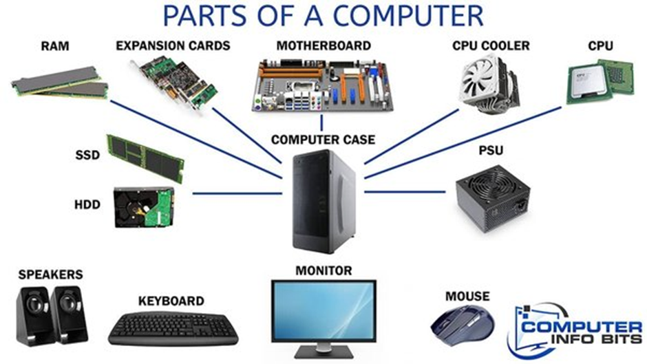
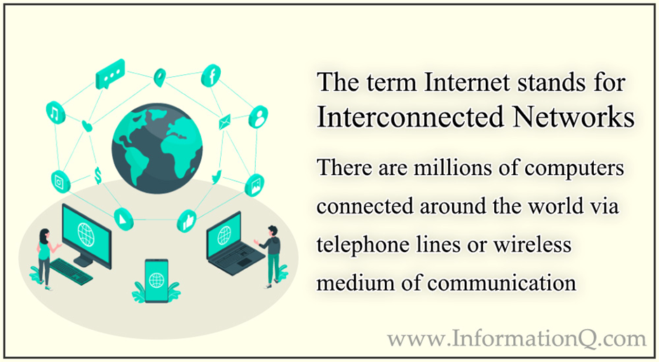
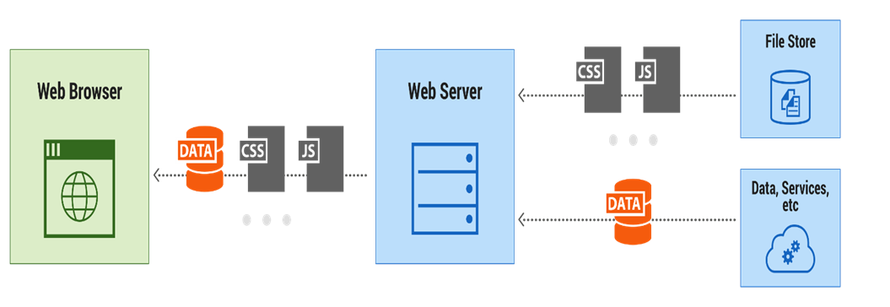
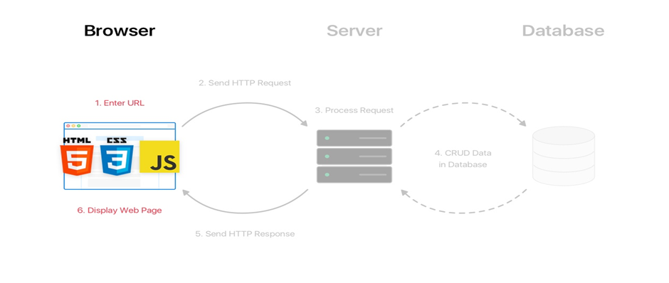
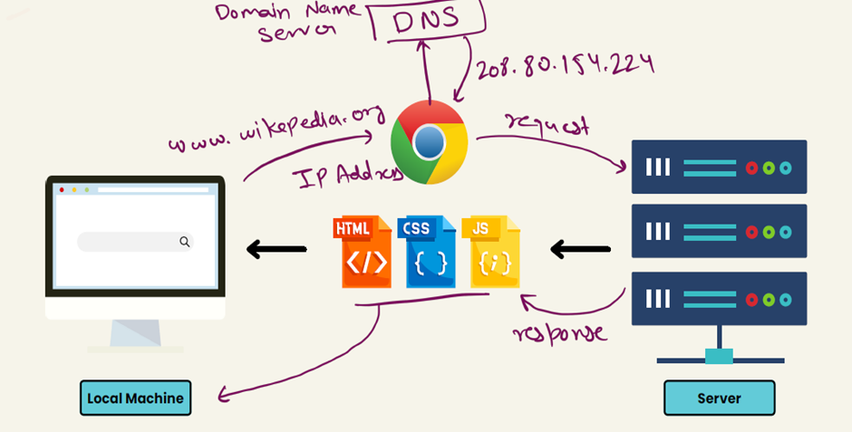
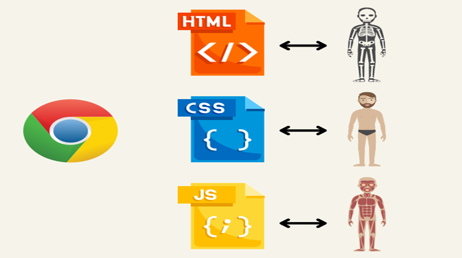

## 🖥️ What is a Computer?

A **computer** is an electronic device that:

* Accepts **data** (input)
* **Processes** it according to instructions
* **Stores** it temporarily/permanently
* Produces **useful information** (output)

It works on the principle of:
**Input → Process → Output → Storage**

---

## 🧩 Components of a Computer

### 1. Input Devices

Used to enter data and instructions.
**Examples:** Keyboard, Mouse, Scanner, Microphone, Webcam, Touchscreen

---

### 2. Output Devices

Used to display or communicate results.
**Examples:** Monitor, Printer, Speakers, Projector

---

### 3. Storage Devices

Used to store data permanently or temporarily.

* **Primary Storage (fast, temporary):** RAM, Cache
* **Secondary Storage (permanent):** Hard Disk, SSD, Pen Drive, CD/DVD

---

### 4. Central Processing Unit (CPU)

The **brain of the computer** – executes instructions.

* **ALU (Arithmetic Logic Unit):** Performs calculations & logical operations
* **CU (Control Unit):** Directs data flow and controls components
* **Registers:** Small, high-speed storage inside CPU

---

### 5. Memory

* **RAM (Random Access Memory):** Temporary, volatile memory for current tasks
* **ROM (Read Only Memory):** Permanent memory with essential instructions (e.g., BIOS)

---

### 6. Motherboard

The **main circuit board** that connects CPU, memory, storage, and peripherals together.

---

### 7. Power Supply (SMPS)

Converts electricity from **AC (wall supply) → DC** to power computer components.

---

### 8. Communication Devices

Used for networking and Internet.
**Examples:** Modem, NIC (Network Interface Card), Wi-Fi adapter

---

✅ **Summary:**
A computer = **Input + Output + CPU + Memory + Storage + Motherboard + Power + Communication**

---

---

## 🌐 Internet

The **Internet** is a global network of interconnected devices that communicate using **TCP/IP (Transmission Control Protocol / Internet Protocol).**

It allows devices worldwide to exchange data, share resources, and access services like **WhatsApp, Email, Cloud, Streaming, IoT**, etc.

### Key Features

* 🌍 **Decentralized Network** – No single authority controls it
* 📡 **Protocols** – Communication rules (HTTP, HTTPS, FTP, SMTP)
* 💾 **Services** – Email, Web (WWW), Cloud, Streaming, IoT
* 🆔 **Identifiers** – Every device has a unique IP address; domain names map to IPs via DNS

---

---

## 🖥️ Client-Server Architecture

A **distributed computing model** used to design applications and systems over a network.

### 1. Definition

* **Client** → Sends requests (e.g., Web Browser)
* **Server** → Processes requests & sends back responses (e.g., Web Server)

**Example:**
When you type **[www.google.com](http://www.google.com)** in your browser:

1. Client (browser) → sends request → Google’s server
2. Server → processes request → sends response
3. Client → displays result

---

### 2. Working of Client-Server

1. Client sends request (HTTP/HTTPS)
2. Server processes request
3. Server responds with data (HTML, JSON, files, etc.)
4. Client displays/uses response

---

### 3. Types of Servers

* 🌐 **Web Server** – Apache, Nginx
* ⚙️ **Application Server** – Node.js, Express, Django
* 🗄️ **Database Server** – MySQL, MongoDB, PostgreSQL
* 📂 **File Server** – Storage & access
* 📧 **Mail Server** – SMTP, IMAP, POP3

---

### 4. Advantages

✔️ Centralized data & security
✔️ Scalable & maintainable
✔️ Ensures data integrity

---

### 5. Disadvantages

❌ Single point of failure
❌ High cost of servers
❌ Network dependency

---

### 6. Real-Life Examples

* 🌍 Web Browsing – Browser ↔ Web Server
* 🏦 Banking Apps – Mobile App ↔ Bank Server
* 🎮 Online Games – Player ↔ Game Server
* 📧 Email – Gmail/Outlook ↔ Mail Server

---

---

---

---

## 🌐 Web Development Basics (HTML CSS JS)

### 🔧 Tools to Install

* **VS Code** (with auto-save)
* **Live Server extension**
* **Browser** (Chrome/Firefox) for compiling HTML, CSS, JS

### 🖼️ Web Technologies

* **HTML (Structure)** – Skeleton of a webpage
* **CSS (Style)** – Designs & layouts
* **JavaScript (Logic)** – Makes pages interactive
* **library/framwork**
---